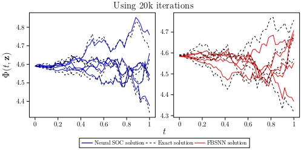

# [Forward-Backward Stochastic Neural Networks](https://github.com/EmoryMLIP/FBSNNs/) #
This is a fork of the original repository at https://github.com/maziarraissi/FBSNNs, modified according to approaches considered in the paper:
- [A Neural Network Approach for Stochastic Optimal Control](https://arxiv.org/pdf/2209.13104.pdf)

We ran our tests under Python 3.6.8, required packages are listed in [install.txt](https://github.com/EmoryMLIP/FBSNNs/blob/master/install.txt).

#### Major diferences from the original repository at https://github.com/maziarraissi/FBSNNs ####
- [HamiltonJacobiBellman100D.py](https://github.com/EmoryMLIP/FBSNNs/blob/master/HamiltonJacobiBellman100D.py)
  - Updated definition of functions [phi_tf()](https://github.com/EmoryMLIP/FBSNNs/blob/19f69971115009e23bd507ca65d23360813399f3/HamiltonJacobiBellman100D.py#L32) and [mu_tf()](https://github.com/EmoryMLIP/FBSNNs/blob/19f69971115009e23bd507ca65d23360813399f3/HamiltonJacobiBellman100D.py#L41) to include drift term in the dynamics.
- [Neural_SOC.py](https://github.com/EmoryMLIP/FBSNNs/blob/master/Neural_SOC.py)  
  - Inherits the [FBSNN](https://github.com/EmoryMLIP/FBSNNs/blob/master/FBSNNs.py) class and updates the [loss function](https://github.com/EmoryMLIP/FBSNNs/blob/master/Neural_SOC.py#L78) to include the originial control objective of the stochastic optimal control problem.
  
 Below is a comparision between two approches, with drif term (left) and without drift term (right), on a 100-dimensional Hamilton-Jacobi-Bellman PDE. 
 

     

  
Classical numerical methods for solving partial differential equations suffer from the curse of dimensionality mainly due to their reliance on meticulously generated spatio-temporal grids. Inspired by modern deep learning based techniques for solving forward and inverse problems associated with partial differential equations, we circumvent the tyranny of numerical discretization by devising an algorithm that is scalable to high-dimensions. In particular, we approximate the unknown solution by a deep neural network which essentially enables us to benefit from the merits of automatic differentiation. To train the aforementioned neural network we leverage the well-known connection between high-dimensional partial differential equations and forward-backward stochastic differential equations. In fact, independent realizations of a standard Brownian motion will act as training data. We test the effectiveness of our approach for a couple of benchmark problems spanning a number of scientific domains including Black-Scholes-Barenblatt and Hamilton-Jacobi-Bellman equations, both in 100-dimensions. 

For more information, please refer to the following: (https://maziarraissi.github.io/FBSNNs/)

  - Raissi, Maziar. "[Forward-Backward Stochastic Neural Networks: Deep Learning of High-dimensional Partial Differential Equations](https://arxiv.org/abs/1804.07010)." arXiv preprint arXiv:1804.07010 (2018).
  
  - Video: [Forward-Backward Stochastic Neural Networks](https://youtu.be/-Pu_ZTJsMyA)
  
  - Slides: [Forward-Backward Stochastic Neural Networks](https://github.com/maziarraissi/FBSNNs/blob/master/docs/FBSNNs.pdf)
  

## Citation
   @article{raissi2018forward,
      title={Forward-Backward Stochastic Neural Networks: Deep Learning of High-dimensional Partial Differential Equations},
      author={Raissi, Maziar},
      journal={arXiv preprint arXiv:1804.07010},
      year={2018}
    }

